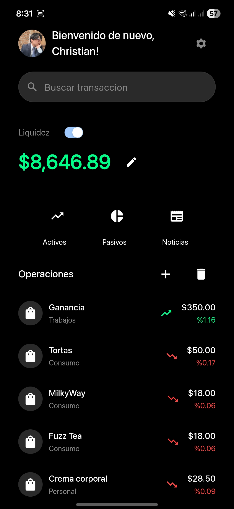
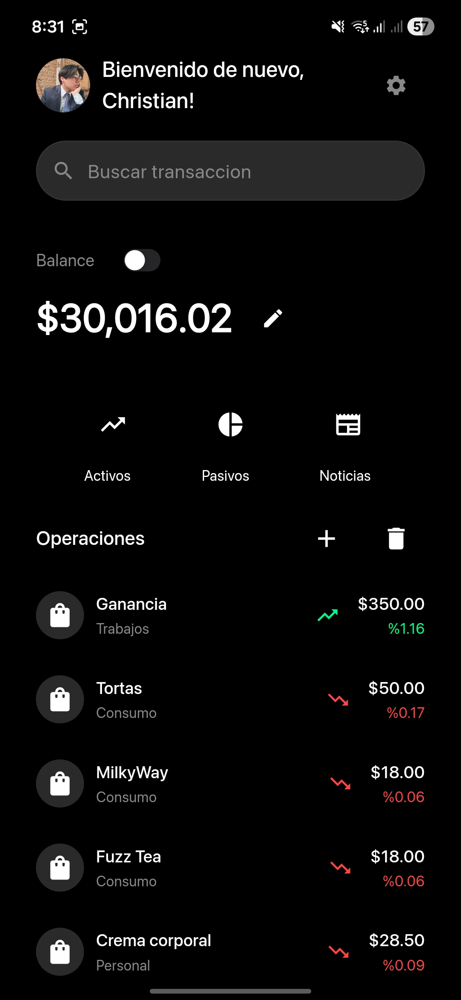
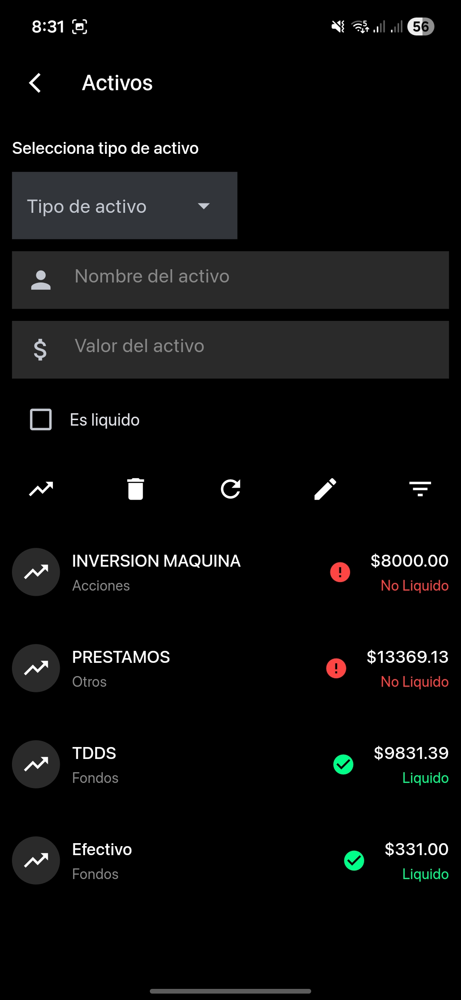
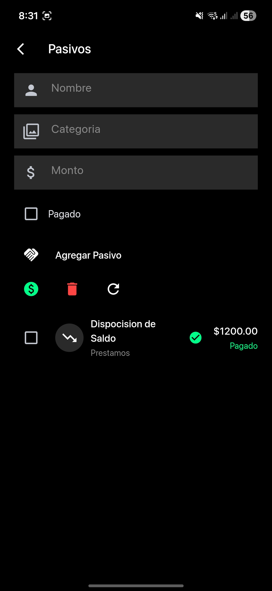
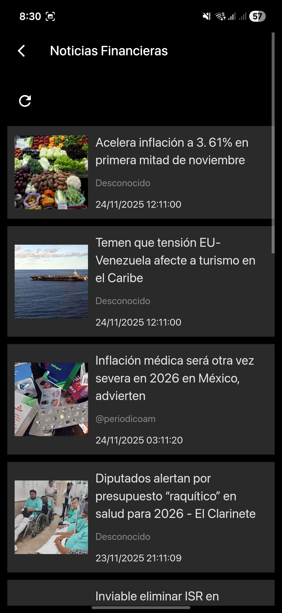

# Balance - Aplicación de Gestión Financiera

Una aplicación integral de gestión de finanzas personales construida con Flet (Python) que te ayuda a rastrear tu balance, transacciones, activos, pasivos y mantenerte actualizado con noticias financieras.

## Descripción General

Balance es una aplicación financiera moderna con tema oscuro diseñada para ayudarte a gestionar tus finanzas personales de manera efectiva. La aplicación proporciona una solución completa para rastrear tu salud financiera, incluyendo gestión de balance, registro de transacciones, seguimiento de activos y pasivos, y acceso a noticias financieras.

## Capturas de Pantalla

<table>
  <tr>
    <td align="center">
      <br>
      <sub>Panel Principal 1</sub>
    </td>
    <td align="center">
      <br>
      <sub>Panel Principal 2</sub>
    </td>
    <td align="center">
      <br>
      <sub>Transacciones</sub>
    </td>
    <td align="center">
      <br>
      <sub>Activos</sub>
    </td>
    <td align="center">
      <br>
      <sub>Pasivos</sub>
    </td>
    <td align="center">
      <br>
      <sub>Noticias</sub>
    </td>
  </tr>
</table>

## Características

### 🏠 Panel Principal

El panel principal proporciona una visión integral de tu estado financiero de un vistazo.

**Características Principales:**
- **Visualización de Balance/Liquidez**: Alterna entre ver tu balance total y activos líquidos
- **Modo de Transacciones**: Cambia entre el modo Balance/Liquidez y el modo Ingresos/Gastos
- **Búsqueda Rápida**: Busca entre tus transacciones por nombre o categoría
- **Lista de Transacciones**: Visualiza todas tus transacciones recientes con indicadores codificados por colores (verde para ingresos, rojo para gastos)
- **Navegación Rápida**: Acceso fácil a las secciones de Activos, Pasivos y Noticias
- **Personalización de Perfil**: Personaliza tu foto de perfil y mensaje de bienvenida

### 💰 Transacciones

Registra y gestiona todas tus transacciones financieras con facilidad.

**Características:**
- Agregar nuevas transacciones con nombre, categoría y monto
- Marcar transacciones como ingresos (suma al capital) o gastos
- Ver historial de transacciones con cálculos de porcentaje
- Buscar y filtrar transacciones
- Eliminar transacciones individualmente o en lote

### 📊 Gestión de Balance

Mantén un registro de tu balance financiero actual y actualízalo según sea necesario.

**Características:**
- Ver balance actual con marca de tiempo de última actualización
- Actualizar balance manualmente
- Rastrear cambios de balance a lo largo del tiempo

### 📈 Activos

Gestiona tus activos e inversiones en diferentes categorías.

**Tipos de Activos:**
- Acciones
- Bonos
- Fondos
- Criptomonedas
- Bienes raíces
- Venta
- Otros

**Características:**
- Agregar activos con nombre, tipo y valor
- Marcar activos como líquidos o no líquidos
- Ver todos los activos en una lista organizada
- Editar y eliminar activos
- Indicadores visuales para activos líquidos vs no líquidos

### 📉 Pasivos

Rastrea tus deudas y pasivos para mantener una imagen clara de tus obligaciones financieras.

**Características:**
- Agregar pasivos con nombre, categoría y monto
- Marcar pasivos como pagados o no pagados
- Indicadores de estado visuales (verde para pagado, rojo para no pagado)
- Pagar pasivos con un clic
- Eliminar múltiples pasivos a la vez
- Actualizar lista para ver el estado actualizado

### 📰 Noticias Financieras

Mantente informado con las últimas noticias financieras y actualizaciones del mercado.

**Características:**
- Navegar por los últimos artículos de noticias financieras
- Ver imágenes de artículos, títulos, autores y fechas de publicación
- Actualizar para obtener las últimas noticias
- Interfaz limpia basada en tarjetas para una lectura fácil

## Instalación

### Requisitos Previos

- Python 3.9 o superior
- Gestor de paquetes pip o uv

### Configuración

1. Clona el repositorio:
```bash
git clone <repository-url>
cd financeapp
```

2. Instala las dependencias:
```bash
pip install -r src/requirements.txt
```

O usando uv:
```bash
uv pip install -r src/requirements.txt
```

3. Ejecuta la aplicación:
```bash
cd src
python main.py
```

## Configuración

### Configuración Inicial

Cuando ejecutes la aplicación por primera vez, se te pedirá:
- Ingresar tu nombre
- Seleccionar tu género (para saludos personalizados)

### Ajustes

Accede a los ajustes desde el panel principal para configurar:
- **Modo de Transacciones**: Alternar entre la vista Balance/Liquidez y la vista Ingresos/Gastos
- **Modo de Portafolio**: Cambiar entre diferentes métricas financieras

## Estructura del Proyecto

```
financeapp/
├── src/
│   ├── main.py              # Punto de entrada principal de la aplicación
│   ├── controller.py        # Controladores de lógica de negocio
│   ├── database.py          # Modelos y operaciones de base de datos
│   ├── db_connection.py     # Manejo de conexión a base de datos
│   ├── requirements.txt     # Dependencias de Python
│   ├── assets/              # Recursos de la aplicación (imágenes, fuentes)
│   └── storage/             # Directorio de almacenamiento de datos
├── screenshots/             # Capturas de pantalla de la aplicación
├── pyproject.toml           # Configuración del proyecto
└── README.md                # Este archivo
```

## Stack Tecnológico

- **Framework**: Flet 0.28.3
- **Lenguaje**: Python 3.9+
- **Base de Datos**: SQLite (financeapp.db)
- **Interfaz**: Tema oscuro con diseño moderno

## Características en Detalle

### Gestión de Transacciones
- Actualización automática del balance cuando se agregan transacciones
- Cálculo de porcentaje para cada transacción
- Organización basada en categorías
- Funcionalidad de búsqueda para acceso rápido

### Seguimiento de Activos
- Soporte para múltiples tipos de activos
- Seguimiento de liquidez
- Indicadores de estado visuales
- Soporte para operaciones en lote

### Gestión de Pasivos
- Seguimiento del estado de pago
- Procesamiento rápido de pagos
- Organización por categorías
- Visualización de estado

### Integración de Noticias
- Noticias financieras en tiempo real
- Visualización de metadatos de artículos
- Soporte de imágenes
- Capacidad de actualización

## Consejos de Uso

1. **Actualizaciones Regulares**: Mantén tu balance y transacciones actualizados regularmente para un seguimiento financiero preciso
2. **Categorización**: Usa categorías consistentes para una mejor organización y resultados de búsqueda
3. **Liquidez de Activos**: Marca los activos líquidos correctamente para obtener cálculos de liquidez precisos
4. **Seguimiento de Pasivos**: Marca los pasivos como pagados cuando se liquiden para mantener un estado financiero preciso
5. **Función de Búsqueda**: Usa la barra de búsqueda para encontrar rápidamente transacciones específicas

## Desarrollo

### Compilación para Móviles

La aplicación se puede compilar para Android e iOS usando el sistema de compilación de Flet:

```bash
flet build apk  # Para Android
flet build ios   # Para iOS
```

### Registro de Eventos

La aplicación mantiene registros en `storage/data/applogs.log` para depuración y monitoreo.

## Licencia

Copyright (C) 2025 por Christianymoon Ltd.

## Autor

**Christian Vergara**
- Email: imchrisyt15@gmail.com

---

*Balance - Tu compañero de finanzas personales*
